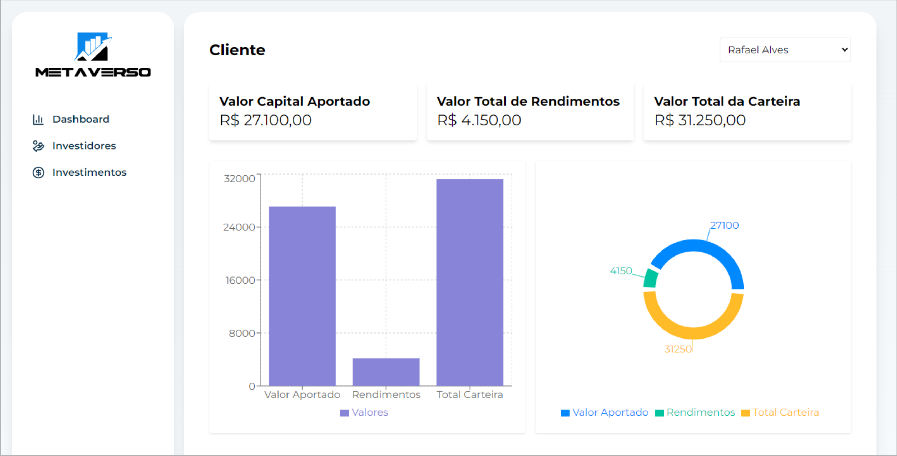
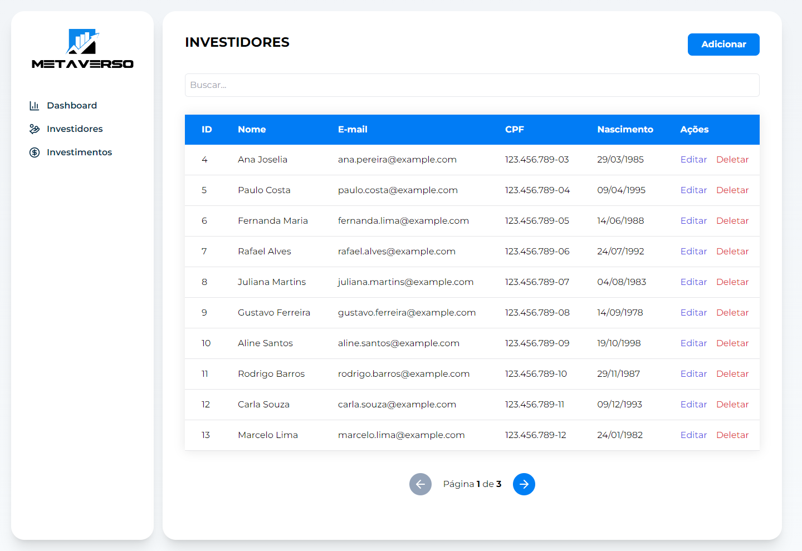
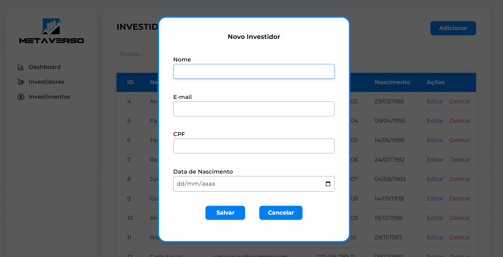
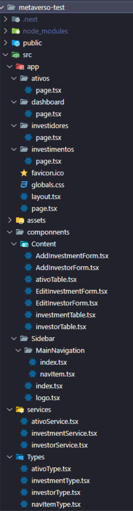

# Metaverso Test

Este é um projeto de teste de conhecimento, uma aplicação de gerenciamento de investidores e investimentos construída com Next.js, TypeScript, React Hook Form, Zod para validação, ApexCharts para gráficos e Tailwind CSS para estilização.

## Imagens do sistema

## Funcionalidades

- Cadastro de Investidores
- Listagem de Investidores
- Edição de Investidores
- Exclusão de Investidores
- Visualização de Investimentos
- Dashboard com gráficos e resumos financeiros

## Tecnologias Utilizadas

- [Next.js](https://nextjs.org/)
- [React](https://reactjs.org/)
- [TypeScript](https://www.typescriptlang.org/)
- [React Hook Form](https://react-hook-form.com/)
- [Zod](https://zod.dev/)
- [ApexCharts](https://apexcharts.com/)
- [Tailwind CSS](https://tailwindcss.com/)
- [Radix UI](https://www.radix-ui.com/)
- [Axios](https://axios-http.com/)

## Estrutura do Projeto

## Instalação e Execução

1. Clone o repositório:

git clone https://github.com/seu-usuario/metaverso-test.git
cd metaverso-test

2. Instale as dependências:

npm install

3. Inicie o servidor de desenvolvimento:

npm run dev

4. Acesse a aplicação em

http://localhost:3000

## Configuração do JSON Server

1. Instale o JSON Server globalmente (se ainda não tiver instalado)

npm install -g json-server

2. Inicie o JSON Server:

npm run json-server

## Uso

### Cadastro de Investidores

1. Navegue até a página de investidores (http://localhost:3000/investidores).
2. Clique em "Adicionar".
3. Preencha o formulário e clique em "Salvar".

### Edição de Investidores

1. Navegue até a página de investidores (http://localhost:3000/investidores).
2. Clique no ícone de edição ao lado do investidor que deseja editar.
3. Atualize os dados no formulário e clique em "Salvar".

### Exclusão de Investidores

1. Navegue até a página de investidores (http://localhost:3000/investidores).
2. Clique no ícone de exclusão ao lado do investidor que deseja excluir.
3. Confirme a exclusão no diálogo de confirmação.

### CRUD de Investimentos segue o mesmo passo acima na URL

(http://localhost:3000/investimentos).

### No dashboard é possível visualizar os gráficos referentes a cada cliente

1. Navegue até a página de dasboard (http://localhost:3000/dashboard).
2. Selecione o cliente que deseja visualizar no dropdown.
